# Java中的设计模式
该库的目的就是为了记录一下在jdk中使用过的设计模式。
## 学习设计模式的七大原则（与我对他们的理解）
1. 开闭原则（对扩展开放，对修改关闭，指要实现可延展性高的代码）
2. 里氏替换原则（不要破坏继承体系，子类重写方法功能发生改变，不应该影响父类方法的含义	）
3. 依赖倒置原则（高层不应该依赖低层，要面向接口编程，不要面向实现编程）
4. 单一职责原则（一个类只干一件事，实现类要单一）
5. 接口隔离原则（一个接口只干一件事，接口要精简单一）
6. 迪米特法则（如果两个软件实体无须直接通信，那么就不应当发生直接的相互调用）
7. 合成复用原则（要尽量先使用组合或者聚合等关联关系来实现，其次才考虑使用继承关系来实现）

## 设计模式篇之创建型
### 单例模式
Java中的单例模式体现在Runtime类中，Runtime就是以懒汉式实现了单例模式。
具体看[单例模式实现](src/create/Singleton.java),其实无论从哪个角度，时间和空间只能占其一。

### 原型模式
Java中的原型模式体现在自己自带的Cloneable接口，具体看实现[原型模式实现](src/create/Prototype.java)
其内存二进制流的复制，在性能上比直接 new 一个对象更加优良。

### 简单工厂，工厂方法与抽象工厂
其实这三个负责不同形式下的设计
简单工厂模式，Java在Calendar的getInstance()过程中根据本地编码的不同获得对应的本地日历,[简单工厂实现](src/create/SimpleFactory.java)
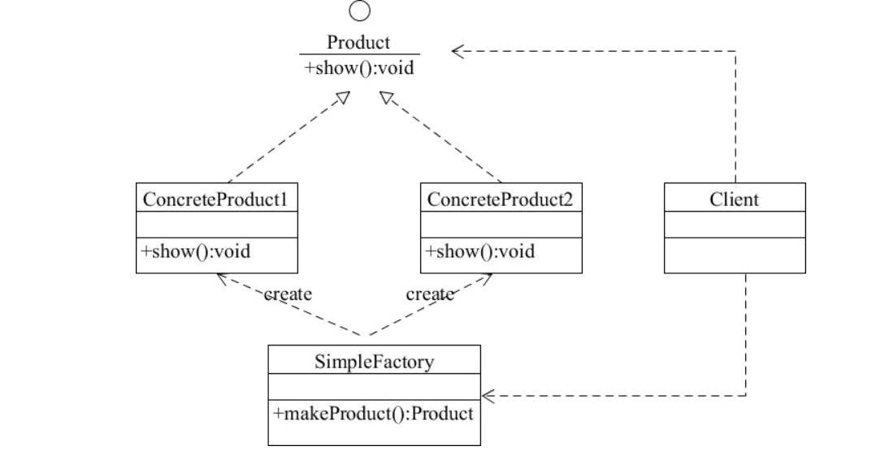

工厂方法模式，Java在ThreadFactory中的newThread()有提到，具体工厂生产具体产品，接口只负责提供抽象方法，[工厂方法实现](src/create/FactoryMethod.java)
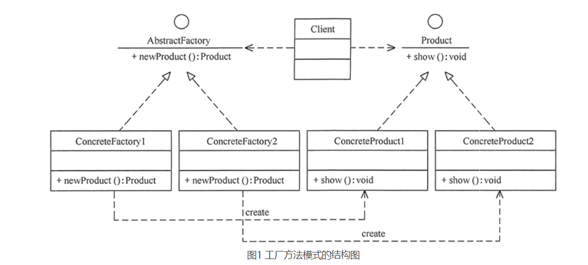

抽象工厂模式，Java的jdk中没看见实现，但是实际上就是工厂方法的基础上在，接口的层面上多定义生成了另一个不同的产品，这里就不写了。
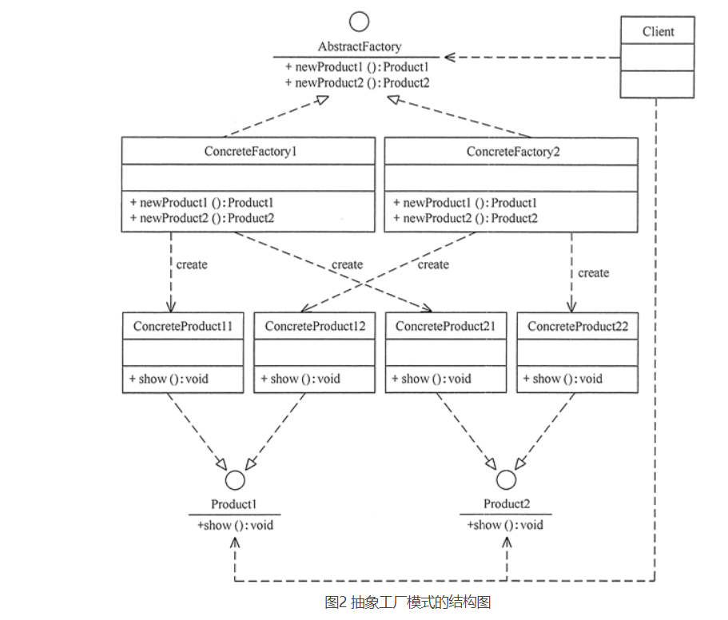

其实三种不同的工厂模式都体现了Java的广义的多态性（子类属于父类的一种）

### 建造者模式
隔离复杂对象的创建和使用，相同的方法，不同执行顺序，产生不同事件结果,其实StringBuilder有那种感觉，但是又不完全是。
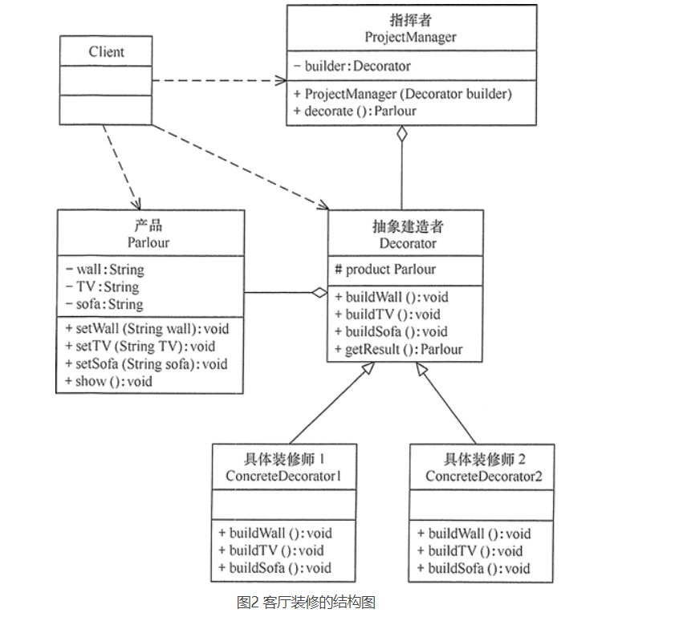
有一种用建造者模式实现链式产生对象的方法，具体看实现[建造者模式实现](src/create/Builder.java)

## 设计模式篇之结构型
### 代理模式
代理模式其实就是由于某些原因需要给某对象提供一个代理以控制对该对象的访问。这时，访问对象不适合或者不能直接引用目标对象，
代理对象作为访问对象和目标对象之间的中介。
Java中的代理模式有JDK自带的动态代理，可以看看
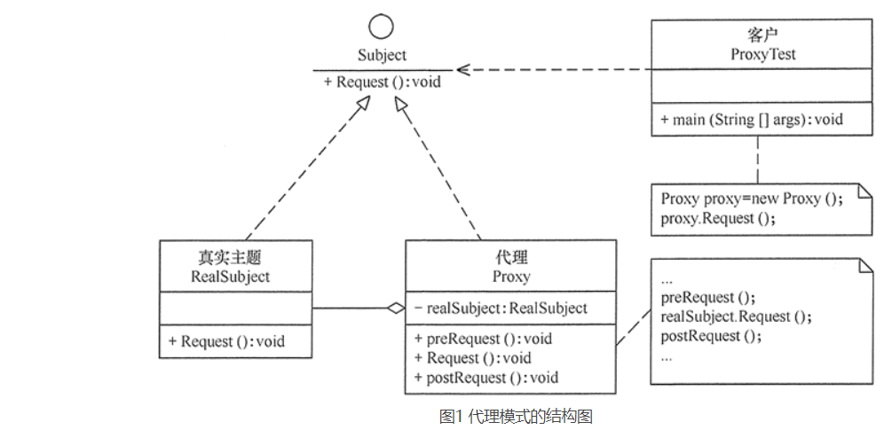
其实代理模式感觉和装饰器模式好像，但是我觉得他们的目的是不同的，一个是为了保护对象，一个是为了让对象真正执行前多一点操作
因此，代理模式应该没有显式的构造对象的过程，而装饰器模式应该有。
[代理模式实现](src/structure/Proxy.java)

### 装饰器模式
指在不改变现有对象结构的情况下，动态地给该对象增加一些职责（即增加其额外功能）的模式，它属于对象结构型模式。
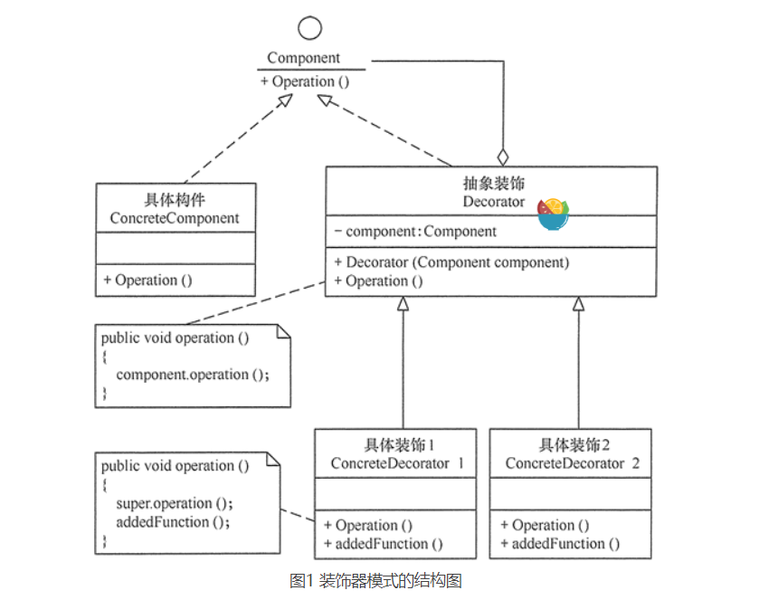
他和代理模式的区别之前已经说了，现在具体看实现
[装饰器模式实现](src/structure/Decorate.java)

### 适配器模式
将一个类的接口转换成客户希望的另外一个接口，使得原本由于接口不兼容而不能一起工作的那些类能一起工作
适配器模式分两种情况，类适配器模式和对象适配器模式，显然，对象适配器模式更符合合成复用原则。
类适配器图片
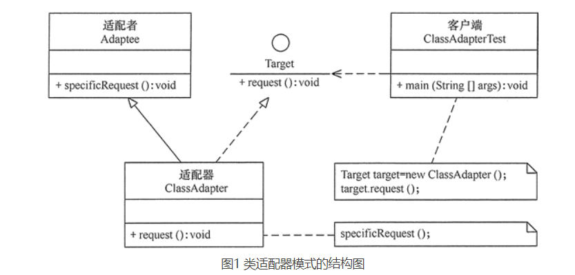
对象适配器图片
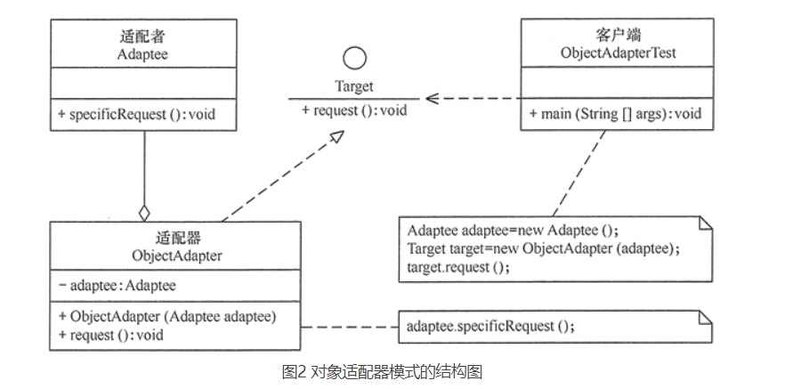
[适配器模式实现](src/structure/Adapter.java)

### 桥接模式
将抽象与实现分离，使它们可以独立变化。
它是用组合关系代替继承关系来实现，从而降低了抽象和实现这两个可变维度的耦合度。
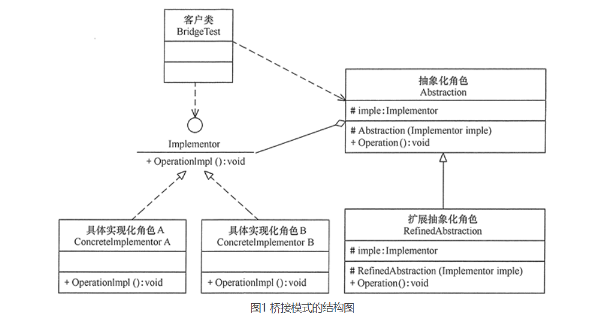
[桥接模式实现](src/structure/Bridge.java)

### 外观模式
又叫作门面模式，是一种通过为多个复杂的子系统提供一个一致的接口，而使这些子系统更加容易被访问的模式
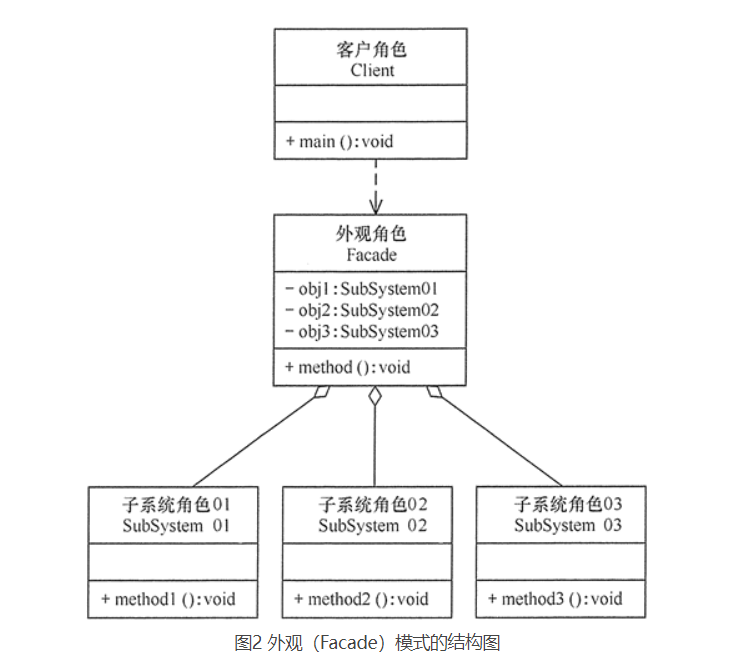
[外观模式实现](src/structure/Facade.java)

### 享元模式
运用共享技术来有效地支持大量细粒度对象的复用。
它通过共享已经存在的对象来大幅度减少需要创建的对象数量、避免大量相似类的开销，从而提高系统资源的利用率
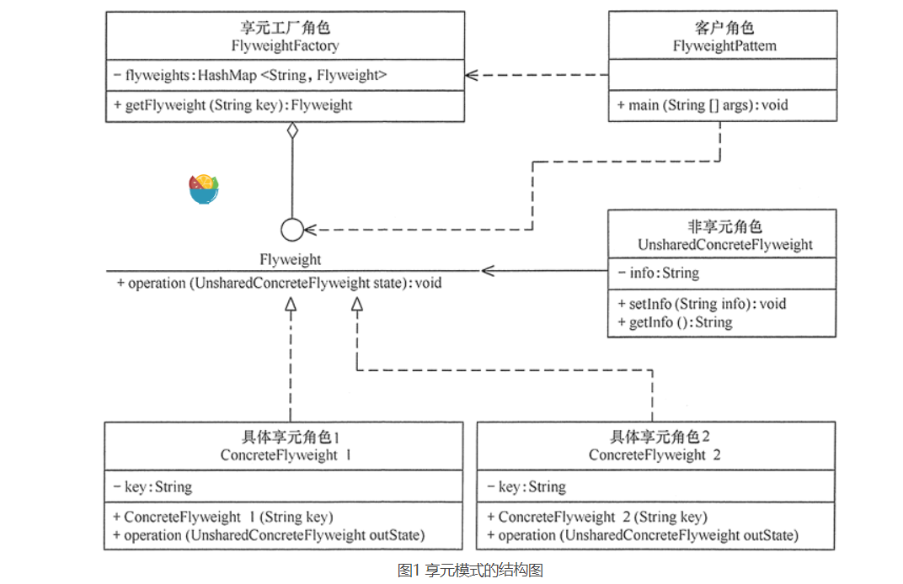
[享元模式实现](src/structure/FlyWeight.java)

### 组合模式
它是一种将对象组合成树状的层次结构的模式，用来表示“整体-部分”的关系，
使用户对单个对象和组合对象具有一致的访问性，属于结构型设计模式。
有透明模式和安全模式两种
透明模式
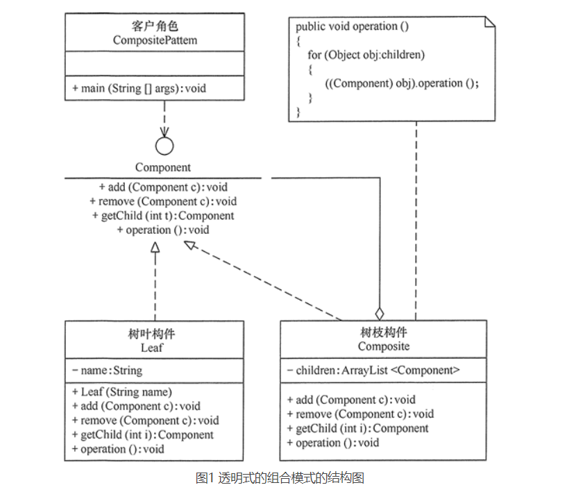
安全方式
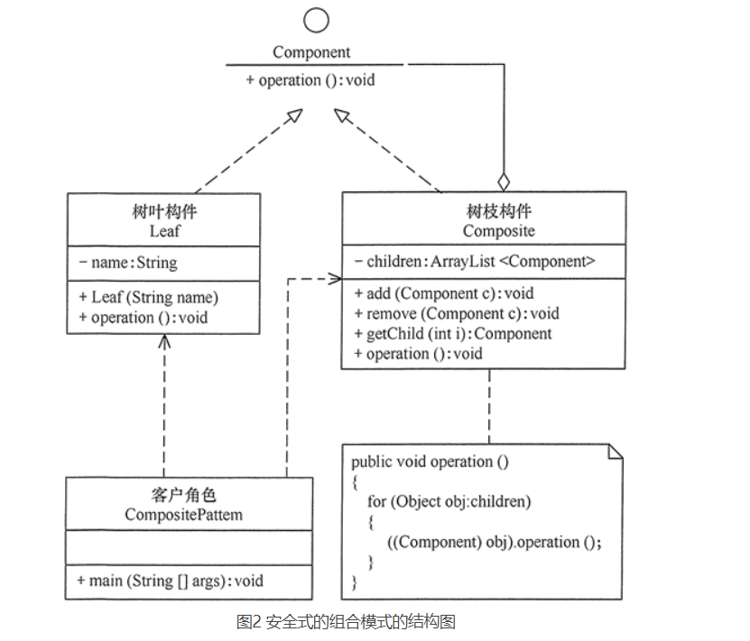
[组合模式实现](src/structure/Composite.java)

## 行为型模式
行为型模式分为类行为模式和对象行为模式，前者采用继承机制来在类间分派行为，
后者采用组合或聚合在对象间分配行为。

### 模板方式模式
定义一个操作中的算法骨架，而将算法的一些步骤延迟到子类中，
使得子类可以不改变该算法结构的情况下重定义该算法的某些特定步骤。它是一种类行为型模式。
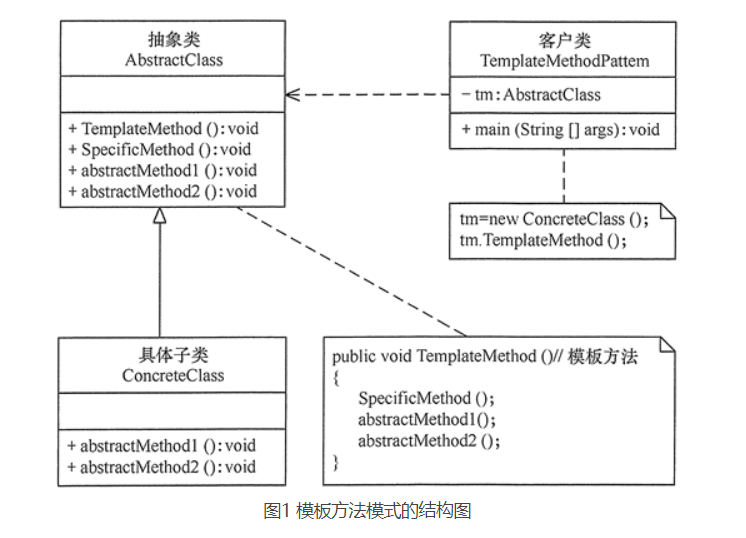
[模板方式实现](src/action/Template.java)

### 策略模式
策略模式是准备一组算法，并将这组算法封装到一系列的策略类里面，作为一个抽象策略类的子类。
策略模式的重心不是如何实现算法，而是如何组织这些算法，从而让程序结构更加灵活，具有更好的维护性和扩展性，现在我们来分析其基本结构和实现方法。
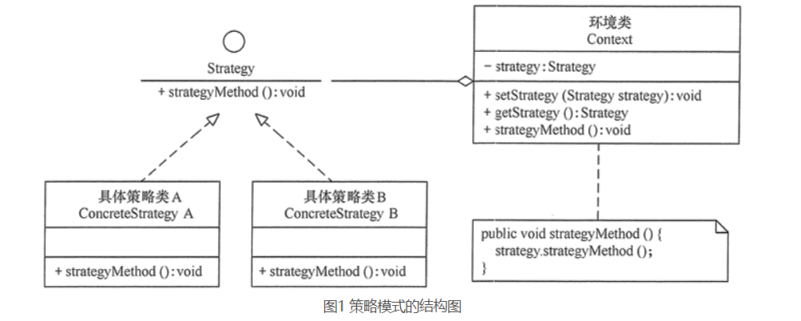
[策略模式实现](src/action/Strategy.java)

